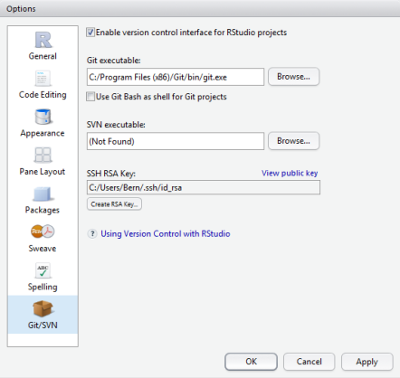
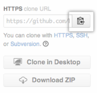
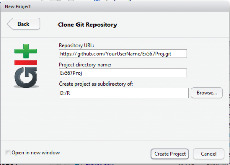

# GitHub-for-RStudio

This site is for setting up GitHub to work with your R projects in RStudio.

Here is the link:  http://psu-envstats.github.io/Github-for-R. 

--------
- 1 **Download Git for your operating system ([link](http://www.git-scm.com/downloads)):**  This program allows R to interface with GitHub. **After installing Git:** *In RStudio select Tools, then Global options, then Git/SVN.  Enable version control for RStudio, then browse to your directory that has git.exe. Select OK, then restart R.*  

- 2 **After you open a GitHub account, click on the "Fork" icon at the top of GitHub page.**  This creates a copy (clone) of the master project directory that is now your repository **(repository = Project in R).**  *Copy the HTTPS clone URL from the box next to your repository on the right. Check the link, it should have your GitHub user name in it.*

- 3 **In RStudio, select new project, then version control, then Git.**  Here is where you will paste the link from the GitHub clone (step 2 above). *Click Tab key and R will create a project name from the one used in GitHub.*

- **Finishing step 3 will automaticly copy all files into your new R directory on your PC.**  These are all the files currently in the main GitHub directory that you forked, so you dont have to start from scratch.  

More detailed description for setting up Github with R from Ecologist ([link](http://www.molecularecologist.com/2013/11/using-github-with-r-and-rstudio/)), and 
Rstudio ([link](https://support.rstudio.com/hc/en-us/articles/200532077-Version-Control-with-Git-and-SVN)).

--------
**Update your Forked directory with upstream Main Project** ([link](https://help.github.com/articles/merging-an-upstream-repository-into-your-fork/)).

In GitHub, copy the link from the main project directory. *Do not copy the link from your forked directory*.  In RStudio, select Tools, then Shell. At the Shell command prompt type:

`> git pull https://github.com/ORIGINAL_OWNER/ORIGINAL_REPOSITORY.git BRANCH_NAME`  

If there are no conflicts, this will update all files in your main PC directory with the main project on GitHub.  Push these changes to our Forked GitHub Repo using the Push option in RStudio.

